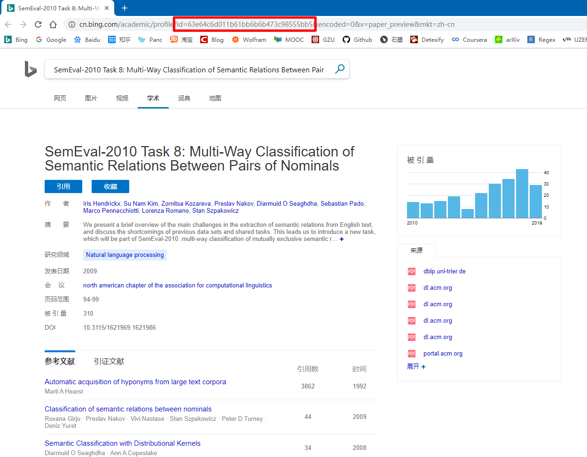
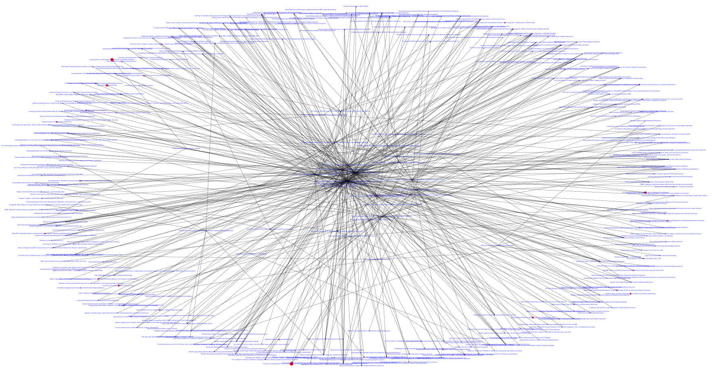

# CitationPace
A paper's citation analysis tool to help you get the latest research trend. 

You can specify the initial paper id from *Bing Academic* and the program will crawl its citations and all the derived citations. 

This project is under going and will support visualization presentations. But now, it just support crawl papers' information from *Bing Academic*.

## Requirements

This project is under going, so it doesn't support *Scrapy* yet. 

```bash
$ pip install requests
$ pip install pymongo # if you'd like to save your data into MongoDB
$ pip install networkx # if you use the default plot.py to visualize the results
```

## Settings

You can change the way you save data and where it will be saved.

For more detailed, you can have a look at the `src/models.py`.

## Usage

### Where is the paper id and how can I get it?

Paper ID is the global unique identifier in *Bing Academic*. You can get the ID via:



## How to start?

Set the Paper ID in `src/spiders.py` and run

```bash
$ python src/spiders.py
```

After the crawling process, you can run `plot.py` as a visualization operation. The picture will be saved into `path_new.pdf`, it is a vectorgraph, so you can zoom in and see some details.



## Update

- update from recursive programming to loop-programming, which obviate stack overflow problems.